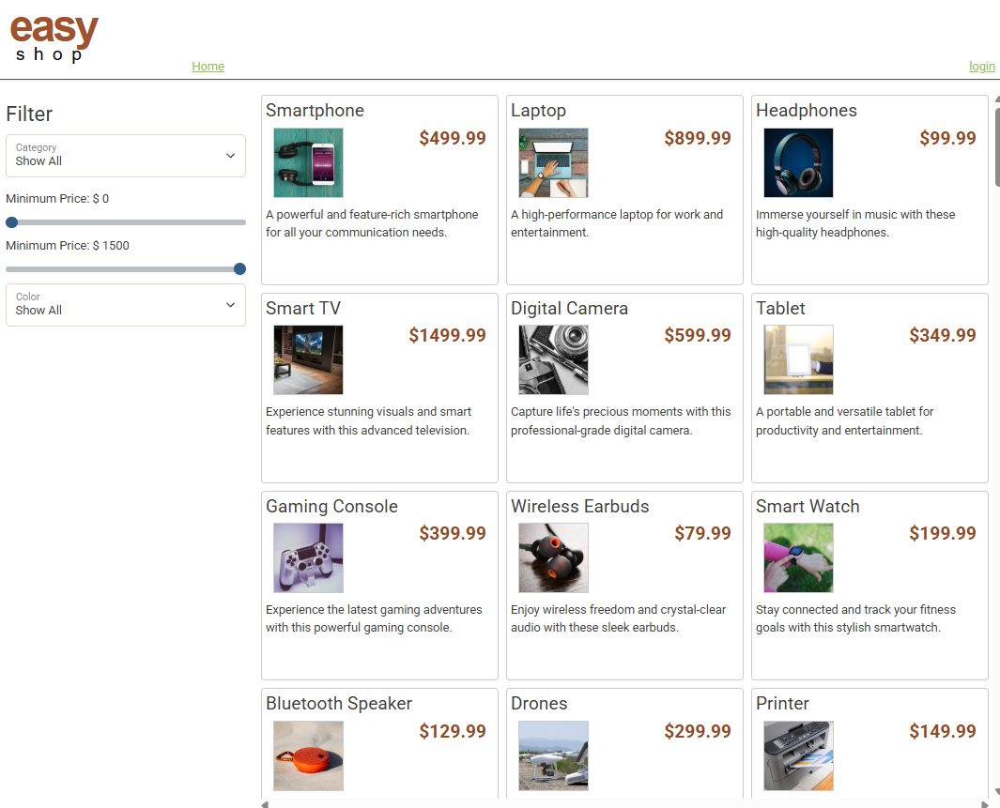
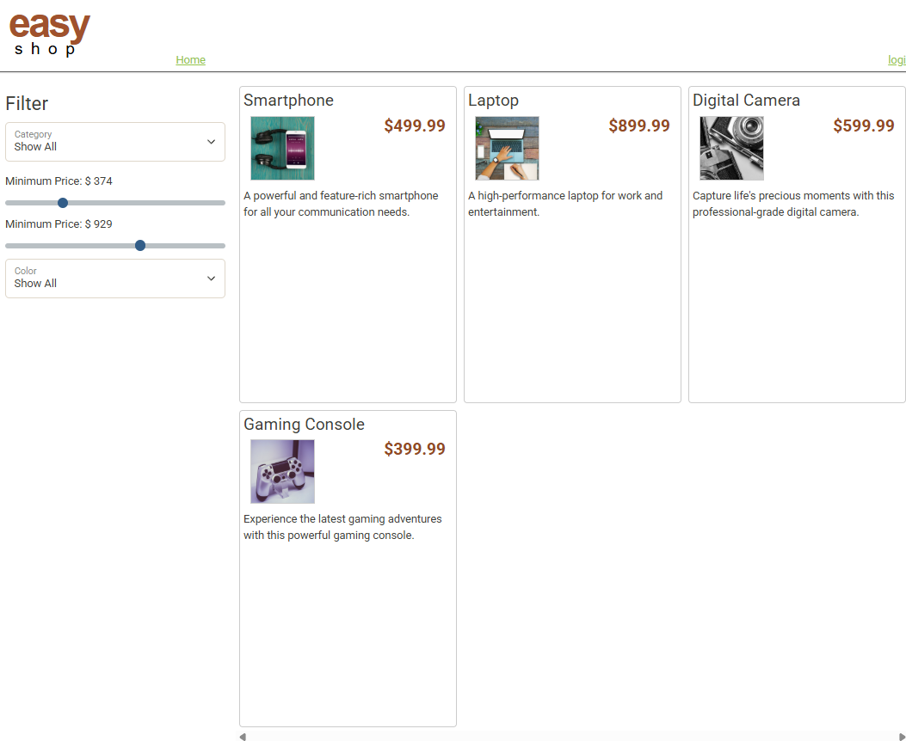

# Capstone 3 – EasyShop (Backend + Frontend)

This project contains a Java Spring Boot backend and a static HTML/CSS/JavaScript frontend.

Structure:

```text
capstone-3/
  backend-api/      # Java Spring Boot backend (Maven)
  frontend-ui/         # Static HTML, CSS, JS
````

---

## Requirements

* **Java Development Kit (JDK) 17**
* **IntelliJ IDEA Community Edition** (latest)
* **MySQL Server** (e.g., MySQL 8.x)
* **MySQL Workbench** (to run the database script)
* Internet browser (Chrome, Firefox, Edge, Safari, etc.)
---

## Description:
Easy Shop uses a Spring Boot API project for the backend server and a MySQL database for data storage. 
For most people it is a user-friendly website used to shop for items around the home. 


## Application Screens:
Home Screen



Functional Filter



## Interesting Code


I found it interesting that statement was written twice. It is written twice because one is if it is being ignored. The other is to apply the filer, if it is not ignored

